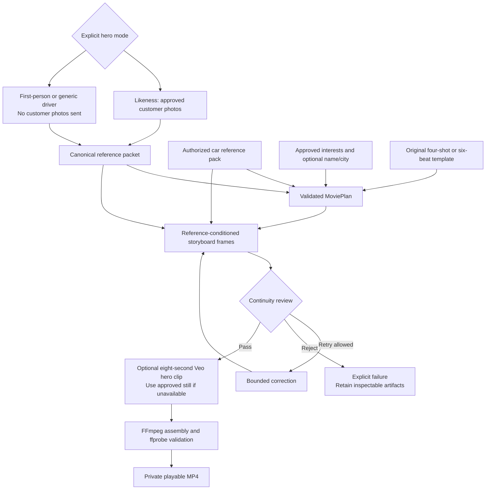
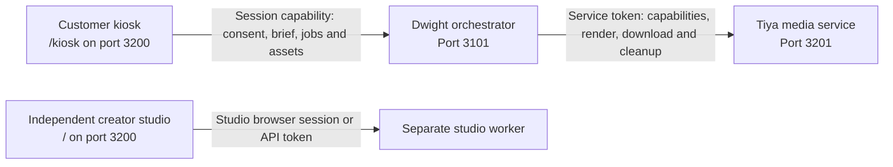

# Magic Pitch Robot - Movie Magic

Tiya's reference-led movie studio and showroom kiosk for MagicPitch. The creator studio builds personalized films from approved references; the kiosk follows Dwight's shared robot session. A separate authenticated media service accepts Dwight's complete advertisement briefs.

[Magic Pitch Robot overview](../README.md) | [System architecture and design](../docs/architecture.md) | [Teammate integration](integration/README.md)

**Dwight / Damian:** start with the [integration handoff](integration/README.md) and the authoritative [Dwight v1 bundle](integration/dwight/TIYA.md). The creator-studio API and orchestrator/media-service protocol are distinct; never exchange their URLs or credentials.

| Surface | Local address | Authentication | Start |
|---|---|---|---|
| Creator studio | `http://127.0.0.1:3200/` | Local browser session or `MOVIE_API_TOKEN` | `npm run dev` plus `npm run worker` |
| Showroom kiosk | `http://127.0.0.1:3200/kiosk` | Dwight device pairing, then shared session capability | `npm run dev`; Dwight API runs separately on 3101 |
| Dwight-to-Tiya media service | `http://127.0.0.1:3201` | Server-only `MEDIA_SERVICE_TOKEN` | `npm run media-service` |

The kiosk never calls the media service or receives a model/provider/service credential. A tablet on another device requires agreed authenticated LAN hosting, exact allowed origins, and trusted HTTPS for browser capture. These local URLs are not remotely deployed services.

The kiosk's photo control uses the tablet/browser's file or camera picker after consent; it does not continuously activate the camera or microphone. This UI sends `media_revealed` only after the video fires actual playback. Damian must not separately acknowledge the same presentation before it plays.

## The workflow



The original customer and car images accompany generation; text notes never replace them. Visual review is a quality assessment, not identity verification or a guarantee of exact likeness.

Four original templates are included:

| Template | Direction |
|---|---|
| `VELOCITY` | Confident, sleek, controlled action-car cinematography |
| `TOMORROW_DRIVE` | A present-day departure becomes an imagined future destination |
| `DREAM_ROUTE` | A warm lifestyle journey toward an approved personal interest |
| `HERO_OF_THE_DAY` | Tiya's warm, human story about showing up for what matters |

Existing callers retain four shots lasting 3, 3, 8, and 4 seconds, for 18 seconds total. Explicit `story_format: "six-shot"` selects Tiya's ordinary moment / spark / crossing over / impossible / mastery / payoff arc. Its durations are 3, 3, 2, 8, 3, 4 seconds (23 total); `HERO_OF_THE_DAY` uses 3, 3, 3, 8, 3, 4 (24 total). The eight-second hero segment keeps the optional Veo operation compatible with its supported frame workflow.

Output is 1280x720, 16:9, 24 fps. Baseline movies use animated storyboard stills; optional Veo replaces only the hero shot (third in classic, fourth in six-shot). Output metadata distinguishes `storyboard-motion` from `hybrid-video`.

Hero modes are explicit, not automatic likeness-failure fallbacks: `LIKENESS` uses approved customer photos; `POV` shows a first-person view without the customer's face; `PERSONALIZED` uses a generic driver from behind or in silhouette. Non-likeness modes do not upload or transmit customer photos.

## Local setup

Use Node.js 22 or newer. From this folder:

```powershell
npm install
Copy-Item .env.example .env
```

Edit `.env` locally. For real generation, configure:

```dotenv
OPENAI_API_KEY=your-private-key
OPENAI_VISION_MODEL=your-accessible-vision-model
OPENAI_DIRECTOR_MODEL=your-accessible-structured-output-model
OPENAI_IMAGE_MODEL=gpt-image-2.5-flare
```

Select vision/text models your account actually supports. The image adapter uses reference-conditioned editing. Account access, organization verification, quota, and current provider policy may prevent a real request even when a key is configured. Readiness indicates local configuration, not a paid account probe.

Start the UI/API and worker in **two terminals**, both in `MoviePart`:

```powershell
npm run dev
```

```powershell
npm run worker
```

Open **http://127.0.0.1:3200**. The configuration panel identifies missing setup without sending generation requests. Refresh readiness after restarting processes or adding configuration.

The worker runs separately from Next requests and persists stages/artifacts on disk. Refreshing the browser does not resubmit a movie. A worker interruption is surfaced rather than blindly repeating potentially billable operations.

### Customer and car references

Use three or four photos of a consenting teammate; one to four are accepted. Select a primary photo to establish wardrobe when outfits differ. Clear front, three-quarter, and full-body views are useful, but unobserved details remain unknown.

Only JPEG, PNG, and WebP are accepted, bounded to 10 MiB per file, 40 MiB per complete upload, and 25 megapixels per decoded image. Image orientation is normalized and unnecessary metadata is removed.

Place the authorized car reference pack in the private local catalog described in [demo-data](demo-data/README.md). The app deliberately does not ship an invented car, unlicensed reference photos, or a fake successful generation. A curated car's appearance and approved claims must match its real references.

The studio now offers **Tesla Model Y** and **Toyota Tundra Hybrid** separately. Select a vehicle, upload its permitted exterior and interior photos, and record the actual color/source. Each remains marked **add references** until its own pack is ready. This does not change Dwight's synthetic `demo-car-v1` contract.

### Renderer and optional audio

The npm dependencies provide local `ffmpeg-static` and `ffprobe-static` binaries. No machine-wide install is required on supported platforms. To use your own binaries, set `FFMPEG_PATH` and `FFPROBE_PATH` to absolute paths.

Optional `MOVIE_MUSIC_PATH` points to a local music file you have permission to use. Without it, the movie remains playable but has no audio, and the UI/manifest reports that explicitly. An audio cue in the director plan is not a generated sound effect.

### Optional Veo enhancement

```dotenv
GEMINI_API_KEY=your-private-key
VEO_MODEL=veo-3.1-generate-preview
```

Enable the hero option explicitly in the demo or set `enable_hero_video: true` in the API request. This sends the required approved references/frames to Google and may incur additional charges. If the enhancement is unavailable, rejected, unsuitable, or times out, an explicit warning accompanies a baseline storyboard-motion movie instead.

Never rely on video-provider access to obtain the baseline advertisement. Conversely, required image-generation or rendering failures are real failures, not silently substituted mock movies.

## API and ownership

The complete portable contract is [integration/contracts.ts](integration/contracts.ts), with a [fetch client](integration/client.ts) and [robot example](integration/README.md).

| API | Purpose |
|---|---|
| `GET /api/movie-config` | Templates, product IDs, local readiness; creates the demo browser session |
| `POST /api/movie-assets` | Consent-gated private photo upload |
| `POST /api/movie-products/{productId}/references` | Operator-confirmed exterior/interior references for the selected Tesla or Toyota |
| `POST /api/movie-jobs` | Idempotent asynchronous submission; returns 202 |
| `GET /api/movie-jobs/{jobId}` | Current status, artifacts, progress, warnings, and errors |
| `GET /api/movie-assets/{assetId}` | Controlled images/video, including byte-range playback |
| `DELETE /api/movie-jobs/{jobId}` | Explicit terminal-job cleanup |

The browser uses an HTTP-only same-origin session. Machine clients use a privately configured `MOVIE_API_TOKEN`; upload and retrieve using the same principal. The development server is loopback-only. Deploying it for a robot on another device requires an explicit authenticated hosting and trusted-origin design, not simply exposing the local server.

Studio polling is implemented. The separate kiosk delegates session state, consent, customer selection, briefing and media commands to Dwight rather than bypassing his orchestrator. Outbound webhooks, robot movement, social discovery, sales dialogue, calendar booking, Trigger.dev, CopilotKit UI integration, and cloud deployment are not implemented by this module.

## Dwight integration

The copied [v1 contract bundle](integration/dwight/README.md) is authoritative for the orchestrator and media adapter. Its OpenAPI documents remain next to `contracts.schema.json` so references resolve. Do not substitute `integration/contracts.ts`, which describes only the creator studio.



The arrows describe distinct application paths, not interchangeable endpoints. The kiosk never receives a service token or calls the creator-studio job API to bypass Dwight's session authority. The studio communicates with its worker through its private API and disk-backed queue.

The kiosk pairs with a device token or joins an existing session from Damian's trusted bridge. It displays explicit consent, confirmed customer/preferences, a reviewable brief, real job state and authorized Blob playback. Result provenance distinguishes generated media, synthetic fixtures, and prerecorded fallback. `media_revealed` belongs to the actual playback event, not to the job becoming ready.

The media service accepts authenticated, globally idempotent `POST /jobs`, returns acceptance before generation, exposes `GET /jobs/{providerJobId}`, and serves only same-base relative MP4 paths. `DELETE /jobs/by-key/{jobId}` must tombstone the key, stop renderer-held work and delete local participant assets before acknowledging cleanup. Dwight calls it after downloading the result as well as on cancellation/failure.

`demo-car-v1` is a synthetic concept brief, not a real Tesla catalog. Its scenes, on-screen copy, CTA and total duration are separate from the creator studio's four/six-shot templates. Agree a real product contract before presenting it as a real-customer product advertisement.

Provider-side retention and already submitted billable operations are not erased by local deletion. Consult the chosen provider's retention policy; a local cancellation acknowledgement covers renderer-held files/work only.

Configure `MEDIA_SERVICE_TOKEN` privately and optionally `MEDIA_SERVICE_PORT` (default 3201). The service can start without OpenAI credentials, but capabilities and new media submissions return 503 until the live image adapter and FFmpeg are configured; authenticated cleanup remains available for prior receipts. No fixture is silently returned as a generated result. `npm run build` builds the Next studio/kiosk; the TypeScript media-service and worker run with `tsx` through their start scripts.

A labeled [synthetic six-second MP4](sample-fixtures/README.md) is supplied only for offline transport/player checks. It must be shown as `mock_fixture` or prerecorded fallback, never as a real-adapter customer movie.

## Tiya ZIP integration

The supplied prototype's creative material is adapted into the existing pipeline rather than launching a second Express app: six-beat scene templates, `HERO_OF_THE_DAY`, explicit hero modes, approved name/city context, deterministic shot-block prompts, and an operator CLI.

Its automatic missing-key mock mode, public output directory, arbitrary input paths over HTTP, in-memory job runner, unverified vehicle claims and shell-interpolated renderer were not carried over. Runtime state remains private and durable, and missing prerequisites remain visible failures.

Use explicit local photo paths only from the trusted operator CLI:

```powershell
npm run cli -- --check
npm run cli -- --consent --template VELOCITY --format six-shot --photo .\demo-data\customer-01\front.jpg --photo .\demo-data\customer-01\three-quarter.jpg --interests "dogs, Egypt"
npm run cli -- --consent --template HERO_OF_THE_DAY --format six-shot --mode POV --city Miami
```

The CLI calls the studio's existing authenticated upload/job API. It does not discover or silently upload private demo files. `--consent` is an operator assertion of actual permission, not a substitute for obtaining it.

## Privacy and truthful progress

- Consent is required before photo upload and generation. Enabling Veo changes the processor disclosure and requires renewed confirmation in the UI.
- No facial identification, social-profile discovery, sensitive attribute inference, or database of recognized people.
- Personalization comes from up to three manually entered or externally approved signals. Generic interests do not establish ownership of a particular pet or facts about family members.
- Private photos, extracted appearance descriptions, generated likeness media, and job data belong in ignored `.movie-data`, never `public` or Git.
- Keep provider keys and machine tokens in ignored `.env`. Do not publish data directories, logs, screen captures of private inputs, or customer advertisements without permission.
- Completed/failed jobs can be deleted through the UI or API. Active jobs cannot be deleted. Do not manually delete a shared data directory while a worker is running.
- Progress labels report the provider that actually executed a stage. No sponsor logos stand in for missing integrations.

## Development

```powershell
npm test
npm run typecheck
npm run build
```

Tests use Node's existing test runner through `tsx`, not a separate test framework. Provider tests use injected fakes and never require customer photos or paid calls. Renderer coverage uses synthetic geometric frames to exercise actual local encoding.

The public interfaces can be copied into another TypeScript project without application dependencies. The server reuses their response types and checks the wire format with runtime schemas.

### Boundaries

`src/domain` contains validation and service interfaces; `src/templates` contains original scene grammar; `src/providers` isolates external models; `src/server` and `src/jobs` own private persistence and transport; `src/render` owns assembly; `src/pipeline.ts` composes stages; `integration` is the teammate-facing contract.

This is local, single-worker filesystem persistence. It is not a distributed queue or multi-tenant production deployment. Do not claim successful live likeness generation without exercising the configured providers and reviewing the resulting frames with the consenting customer.