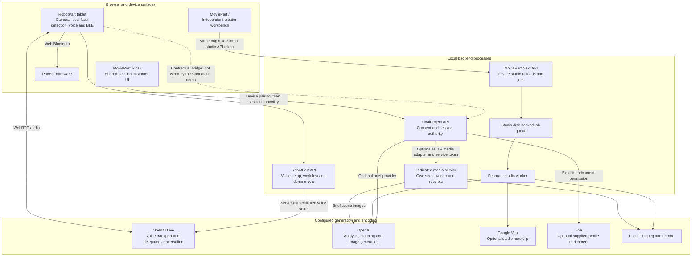
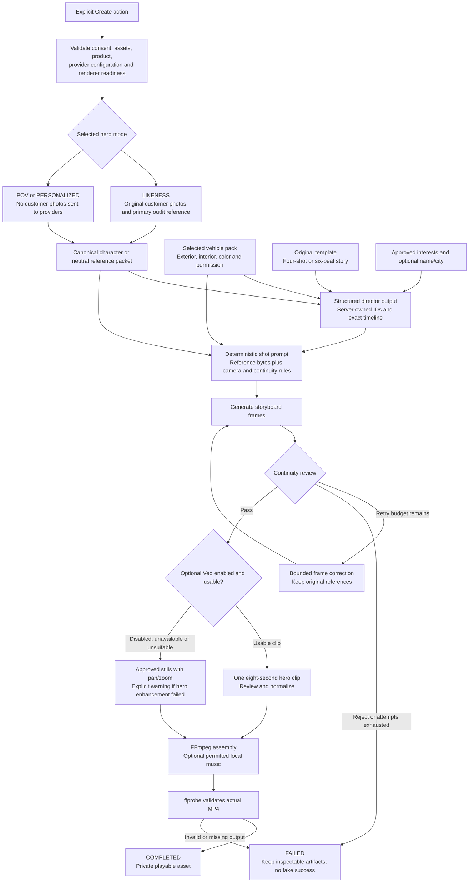
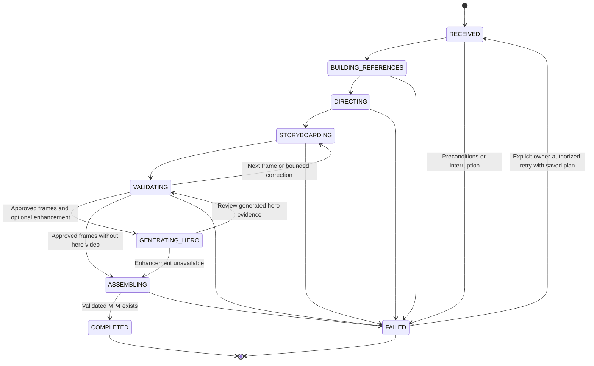
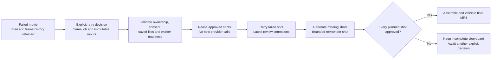

# Magic Pitch Robot: architecture and design

This document describes the implementation in this repository and the boundaries needed to assemble the showroom experience. It does not assume another worktree's launcher, a running local process, or a deployed cloud service is available.

[Project overview](../README.md) | [MoviePart setup](../MoviePart/README.md) | [Orchestrator contracts](../FinalProject/docs/contracts.md)

## 1. Design principles

**Consent before data movement.** Camera permission, permission to generate a likeness, and permission to enrich a profile are different decisions. Enforce the relevant decision at the API boundary, not only in a prompt or checkbox.

**One session, one conversation.** Robot and kiosk integrations must share the same orchestrator session. Its capability authorizes access; a session ID alone does not.

**Plan before rendering.** The creator studio reuses canonical character and product references, a constrained template, and a validated shot plan. Visual review can request a bounded retry; it is not biometric identity verification.

**Acknowledge real outcomes.** Accepting a job, producing a valid file, playing it, and deleting it are separate outcomes. Each has its own state and evidence.

**Separate demos from live operations.** Synthetic fixtures, prerecorded fallback, live generation, and mock booking must never be interchangeable labels.

## 2. Runtime boundaries



The two MoviePart execution paths share a project, not a job contract:

| Path | Input and authority | Rendering behavior |
|---|---|---|
| Creator studio | MoviePart job request, approved interests, selected template, and a real vehicle reference pack | Extracts/plans/reviews four or six shots; optional Veo; animated-still assembly |
| Orchestrator media service | Dwight's complete `AdBrief` and consented PNG/JPEG, submitted by his backend | Uses the brief's scene descriptions and durations; overlays on-screen copy and CTA; renders a synthetic concept MP4 |

The media service does not invoke the studio director to replace the incoming brief. It also does not turn `demo-car-v1` into the studio's Tesla Model Y or Toyota Tundra Hybrid.

The robot backend creates the voice session using its server-side provider credential, then returns the validated WebRTC answer to the tablet. Audio is exchanged through the browser voice transport. Local face detection does not mean voice processing is offline.

## 3. Kiosk and orchestrator interaction

The customer kiosk is an operating surface: visible consent, confirmed customer/preferences, brief review, specific progress, playback, and an always-understandable end-session action. Its pairing controls are for the operator, not an invitation to expose backend credentials.

```mermaid
sequenceDiagram
    actor Customer
    participant UI as Tiya kiosk
    participant O as Dwight orchestrator
    participant M as Tiya media service

    Note over UI,O: Pair a new session or join the robot's existing session through a trusted bridge
    UI->>O: POST /v1/sessions with device token
    O-->>UI: sessionId, sessionToken, serverInstanceId
    Customer->>UI: Review and confirm consent
    UI->>O: POST session events: consent_recorded
    UI->>O: Identify permitted synthetic roster entry
    UI->>O: POST session events: context_updated
    UI->>O: POST commands/create_ad_brief
    O-->>UI: AdBrief with scenes, copy, CTA and total duration
    Customer->>UI: Review brief and permit photo upload
    UI->>O: POST session assets: raw PNG or JPEG
    UI->>O: POST commands/start_media_job with stable client key
    O-->>UI: Session media job

    alt HTTP media mode selected
        O->>M: GET /capabilities with service token
        M-->>O: Validated cancellation and asset-deletion capabilities
        O->>M: POST /jobs with globally unique job ID as idempotency key
        M-->>O: providerJobId before rendering completes
        loop Until terminal state or deadline
            O->>M: GET /jobs/providerJobId
            M-->>O: queued, running, failed or ready
        end
        O->>M: GET relative assets/render-id.mp4
        M-->>O: Valid MP4 bytes
        O->>M: DELETE /jobs/by-key/jobId with independent cleanup deadline
        M-->>O: cancelled, assetsDeleted true after cleanup
        Note over O: Store authorized result; expose ready only after successful cleanup
    else Default mock media mode
        Note over O: Use explicitly synthetic local fixture; do not contact the media service
    end

    UI->>O: GET snapshot afterRevision or GET session job
    O-->>UI: Ready result with provenance and asset metadata
    UI->>O: GET session asset with session capability
    O-->>UI: Authorized MP4 bytes
    Note over UI: Verify bytes and checksum; create a Blob URL
    Customer->>UI: Play movie
    UI->>O: POST session events: media_revealed after actual playback
```

This is the successful path. Any provider failure, expiry, cancellation, invalid output, or unsuccessful cleanup must produce an explicit non-success state. On network uncertainty, retry reads or reconcile the existing job; do not automatically submit a second paid generation.

The kiosk uses `Authorization` for downloads because an HTML video element cannot attach a bearer header by itself. Blob URLs are revoked when replaced, when permission/session validity is lost, and when the view is disposed.

Snapshot `revision` is the polling cursor; context has its own revision. A `resetRequired` snapshot replaces outdated state. A changed `serverInstanceId`, expired session, or revoked capability invalidates the local session rather than silently pairing a new customer.

## 4. Creator-studio filmmaking pipeline



Original photo bytes remain primary identity references in likeness mode. Product references accompany storyboard generation; text descriptions supplement them rather than inventing a replacement vehicle. In first-person/generic-driver modes, even supplied customer images and appearance notes must not leak into provider payloads.

### Timeline contract

| Format | Shot durations in seconds | Total | Optional hero |
|---|---|---|---|
| Classic | 3, 3, 8, 4 | 18 seconds | `shot_03` |
| Six-shot Velocity, Tomorrow Drive, or Dream Route | 3, 3, 2, 8, 3, 4 | 23 seconds | `shot_04` |
| Six-shot Hero of the Day | 3, 3, 3, 8, 3, 4 | 24 seconds | `shot_04` |

Templates are original narrative structures, not recreations of recognizable film scenes. Tiya's six beats are **ordinary moment, spark, crossing over, impossible/journey, mastery, payoff**. The story can change environment intentionally, but not randomly change its protagonist or vehicle.

Frame generation is bounded; a failed real request does not become mock output. Studio continuity checks supplement human review. Generated likeness quality, vehicle fidelity, and account-specific moderation still need live acceptance with the consenting participant.

## 5. Job and cleanup lifecycle



This diagram uses **studio** status names. The media-service wire protocol uses `queued`, `running`, `ready`, and `failed`, with finer progress stages; it must not return a studio status to Dwight.

### Explicit studio recovery

`POST /api/movie-jobs/{jobId}/retry` atomically requeues an eligible failed job with its original ID and a durable retry receipt. The request contains an idempotency key and the expected retry counter. Duplicate delivery returns the existing receipt; a stale counter cannot trigger another paid attempt.



The worker reuses saved character analysis and the director plan. Every new approval is checkpointed before progressing, so a second failure still preserves prior work. A previously attempted optional hero video is not resubmitted merely because final assembly is being retried. Missing approved media blocks the retry rather than silently regenerating it. This recovery endpoint is separate from the media service's cancellation and tombstone protocol.

```mermaid
sequenceDiagram
    participant O as Orchestrator
    participant M as Media service
    participant W as Active renderer
    participant D as Private disk store

    O->>M: DELETE /jobs/by-key/jobId
    M->>D: Persist cancellation tombstone even if POST has not arrived
    M->>W: Abort work and await settlement
    W-->>M: No renderer work remains
    M->>D: Remove uploaded image, brief, intermediates and result
    D-->>M: Cleanup verified
    M-->>O: cancelled, assetsDeleted true
    O->>M: Delayed POST with the same jobId
    M-->>O: Reject cancelled key; do not restart generation
```

If settlement or deletion times out, the service retains a pending cleanup receipt and returns an error, not `assetsDeleted: true`. A fresh, bounded cleanup signal is independent of the aborted rendering signal. Model-vendor retention and already-submitted charges are outside local deletion guarantees.

## 6. Contracts, credentials, and persistence

| Boundary | Credential | Contract and state |
|---|---|---|
| Kiosk pairing -> FinalProject | Device token used only for pairing | Returns a session capability; kiosk holds it in memory, not a URL |
| Kiosk -> session routes/assets | Session token | Versioned snapshots, events, commands, and owned assets |
| FinalProject -> media service | `MEDIA_SERVICE_TOKEN`, server-only | Global job UUID is both body/header idempotency key; changed-payload reuse is rejected |
| Studio browser -> MoviePart API | HTTP-only same-origin session cookie | Private uploads and jobs tied to that browser principal |
| Studio machine client -> MoviePart API | `MOVIE_API_TOKEN` | Separate principal; not interchangeable with the media-service token |
| Backend -> model provider | Private provider API key | Never embedded in browser code, downloaded contracts, or generated docs |

| Store | Lifetime and restart behavior |
|---|---|
| FinalProject sessions/jobs/assets | In-memory and bounded; process restart discards sessions. Re-pairing is explicit. |
| Studio `.movie-data` | Disk-backed uploads, manifests, artifacts and idempotency records. Separate worker claims jobs atomically. Interrupted paid work is not blindly repeated. |
| Media-service private work directory | Image, brief, scene frames and MP4 retained until cleanup; no public static-file directory |
| Media-service receipts | Minimal IDs, request fingerprint and cleanup state survive restart for deduplication and reconciliation |
| Browser Blob URLs | Temporary authorized playback resources, released when no longer needed |

Creator-studio deletion currently applies to terminal jobs. The media-service protocol's active cancellation/tombstone guarantee is a **different endpoint and implementation**. Do not promise active studio cancellation because the service adapter supports it.

Ready-result provenance is also distinct from encoding mode:

- `generated`: output from the real configured media adapter, not proof that a real production vehicle appears.
- `mock_fixture`: explicitly synthetic demonstration media, not the participant.
- `prerendered_fallback`: prerecorded fallback, visibly labeled.
- `storyboard-motion` / `hybrid-video`: studio assembly modes, not authenticity claims.

## 7. Deployment and completion boundaries

- Default local ports are robot UI **5173**, robot development API **8787**, orchestrator **3101**, studio/kiosk **3200**, and media service **3201**.
- Configure an exact kiosk origin in FinalProject's `ALLOWED_ORIGINS`. Allowed-host/origin settings, pairing, and HTTPS need deliberate review before any LAN/public exposure; a host-binding change is not deployment security.
- The current standalone RobotPart talks to its own API and prerecorded movie workflow. Its bridge to the shared orchestrator must be explicitly wired and tested; browser camera permission alone does not grant upload/personalization consent.
- `demo-car-v1` remains a synthetic product contract. Real-vehicle orchestration requires an agreed Product/AdBrief extension and approved facts/assets, not an alias to a studio catalog ID.
- ResearchSocialMediaPart and OfficeCalendarPart are workstream placeholders. FinalProject has an optional Exa adapter but only disabled follow-up execution; RobotPart's test-drive booking is a mock workflow.
- No distributed queue, Cloud Run deployment, Trigger.dev execution, or live CRM/calendar delivery is asserted by these diagrams.
- Automated HTTP/encoding checks are separate from physical safety, live-provider acceptance, visual fidelity, and customer-observed playback.

## Source map

| Design surface | Implementation or contract |
|---|---|
| Kiosk controller and authorized client | [Controller](../MoviePart/src/kiosk/controller.ts), [client](../MoviePart/integration/orchestrator-client.ts) |
| Session workflow and provider selection | [Orchestrator](../FinalProject/src/orchestrator/service.ts), [configuration](../FinalProject/src/config.ts) |
| Studio pipeline and templates | [Pipeline](../MoviePart/src/pipeline.ts), [templates](../MoviePart/src/templates/index.ts) |
| Studio worker and persistence | [Worker](../MoviePart/src/jobs/worker.ts), [store](../MoviePart/src/jobs/store.ts) |
| Media-service acceptance and cleanup | [Service](../MoviePart/src/media-service/service.ts), [HTTP](../MoviePart/src/media-service/http.ts) |
| Brief-driven encoding and on-screen copy | [Executor](../MoviePart/src/media-service/executor.ts), [renderer](../MoviePart/src/media-service/render.ts) |
| Hardware/browser demo | [Robot UI](../RobotPart/src/main.jsx), [PadBot protocol](../RobotPart/RobotLibrary/README.md) |
| Portable teammate handoff | [OpenAPI, schemas and examples](../FinalProject/interfaces/v1/README.md) |
